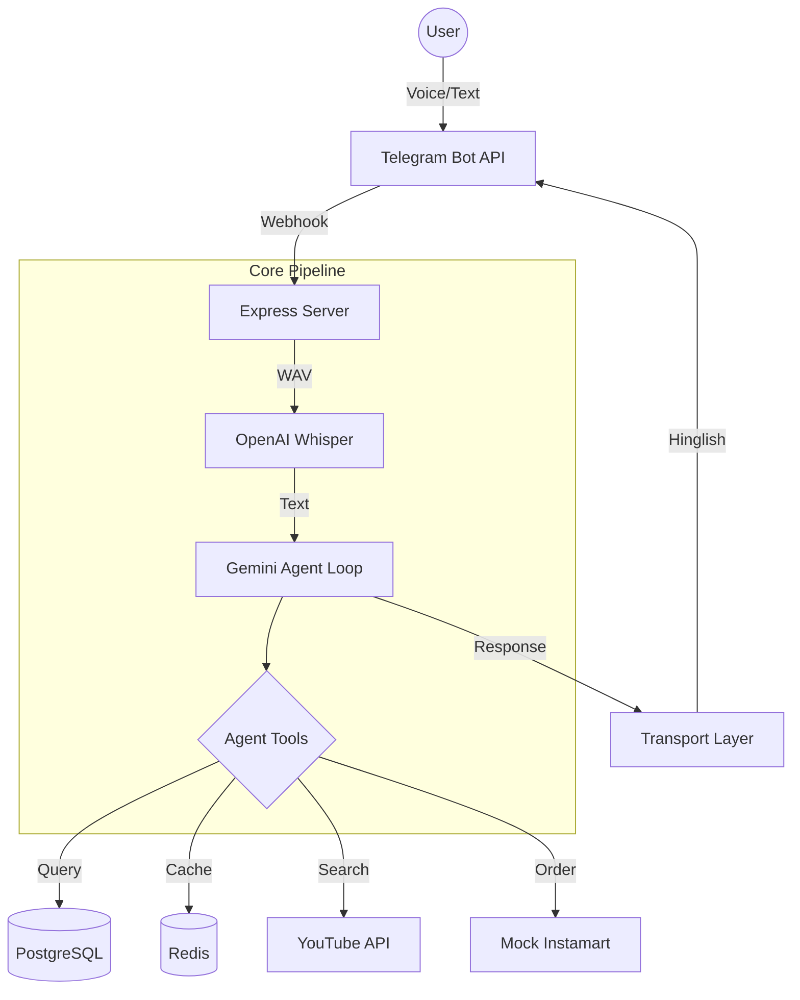

# TiffinSet 🍱

**Voice-first kitchen management bot for modern Indian households.**

TiffinSet is an AI-powered kitchen orchestrator designed to bridge the gap between busy homeowners, cooks, and family members. It turns voice notes into actionable kitchen workflows—from managing groceries to personalized recipe instructions.

[](https://opensource.org/licenses/ISC)
[](https://nodejs.org/)
[](https://www.postgresql.org/)
[](https://ai.google.dev/)

---

## ✨ Key Features

- 🎙️ **Voice-First Interaction**: Send voice notes in English or Hinglish; processed via OpenAI Whisper.
- 🤖 **Agentic AI Core**: Powered by Gemini 3 Flash with a custom tool-calling loop for real-time kitchen tasks.
- 🥘 **Shared Kitchen Sessions**: A unified space for Owners, Cooks, and Contributors to sync on meals.
- 📝 **Recipe Intelligence**: Search for recipes, watch YouTube tutorials, and save personalized overrides (e.g., "Kam mirch, bina lehsun").
- 🛒 **Smart Pantry**: Mock Swiggy Instamart integration for automated cart management and order tracking.
- 📬 **Kitchen Routing**: Intelligently routes messages—if the cook asks for salt, the owner gets a notification.
- ⏰ **Proactive Nudges**: Daily leftover checks and reorder reminders via scheduled cron jobs.

---

## 🛠️ Tech Stack

- **Runtime**: Node.js 20 (ESM)
- **Framework**: Express.js
- **Artificial Intelligence**:
  - **Orchestration**: Google Gemini 3 Flash (Agentic Loop)
  - **Speech-to-Text**: OpenAI Whisper
- **Databases**:
  - **Primary**: PostgreSQL 16 (Managed on GCP)
  - **Caching/Session**: Redis 7
- **APIs**: Telegram Bot API, YouTube Data API v3
- **Infrastructure**: GCP Compute Engine, GCP Secret Manager, Nginx, Let's Encrypt
- **Process Management**: PM2 (Cluster Mode)

---

## 🏗️ Architecture



---

## 🚀 Getting Started

### Prerequisites
- Node.js v20.x
- PostgreSQL 16
- Redis 7
- GCP Project with Secret Manager enabled

### Environment Variables
TiffinSet uses **GCP Secret Manager** for security. Ensure your service account has access to:
- `TELEGRAM_BOT_TOKEN`
- `GEMINI_API_KEY`
- `WHISPER_API_KEY`
- `YOUTUBE_API_KEY`
- `WEBHOOK_VERIFY_TOKEN`
- `DATABASE_URL`

### Installation
1. Clone the repository:
   ```bash
   git clone https://github.com/darshan-alt/tiffinset.git
   cd tiffinset
   ```
2. Install dependencies:
   ```bash
   npm install
   ```
3. Run in development mode:
   ```bash
   npm run dev
   ```

---

## 🧪 Testing
We use Jest for unit and integration testing.
```bash
npm test
```

---

## 🚢 Deployment
Deployed on GCP via a custom shell script that handles:
- Git sync
- Remote dependency installation
- PM2 cluster restart

```bash
bash scripts/deploy.sh
```

---

## 🛣️ Roadmap
- [ ] WhatsApp Transport integration
- [ ] Real Swiggy/Blinkit API integration
- [ ] Image recognition for pantry "shelf-ie" checks
- [ ] Multi-lingual support (Tamil, Telugu, Bengali)

---

## 📄 License
This project is licensed under the ISC License.

---
Built with ❤️ for Indian Kitchens. 🇮🇳
